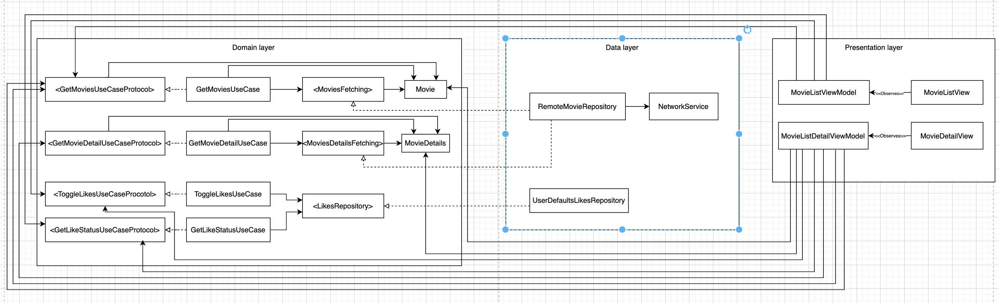

# Movie Browser iOS App

A simple iOS application built with SwiftUI that fetches movies from a public API, allows users to view details and recommendations, and save their "liked" movies. This project was developed following Clean Architecture principles and a Test-Driven Development (TDD) methodology.

## Table of Contents
1.  Features
2.  Architecture
3.  How to Run
4.  Technical Specifications

## 1. Features
This application was developed with a focus on robust functionality and a clean, test-driven architecture.

* **Browse Movies:** Fetches and displays a list of currently playing movies from a remote API.
* **View Details:** Shows a detailed view for each movie, including a description, rating, and release date.
* **See Recommendations:** Displays a list of recommended movies on the detail screen.
* **"Like" System:** Allows users to "like" movies. This preference is persisted locally and the liked status is reflected consistently across all views.
* **Local Persistence:** Liked movie preferences are saved locally using `UserDefaults`, making them available across app launches.
* **Efficient Image Loading:** Images are loaded asynchronously and cached for a smooth scrolling experience and reduced network usage, powered by `SDWebImageSwiftUI`.

## 2. Architecture
The application is built using **Clean Architecture** to create a decoupled, testable, and maintainable codebase.

### 1. Domain Layer (Core)
The core of the application, containing business logic, independent of any UI or data components.

* **Entities:** `Movie`, `MovieDetails`.
* **Use Cases:** Individual, testable business logic units like `GetMoviesUseCase`, `GetMovieDetailsUseCase`, `ToggleLikeUseCase`, and `GetLikeStatusUseCase`.
* **Repository Protocols:** Abstract contracts (`MoviesFetching`, `MovieDetailsFetching`, `LikesRepository`) defining data interactions.

### 2. Data Layer (Implementation)
Responsible for all data operations, implementing the contracts defined in the Domain layer.

* **Repositories:** `RemoteMovieRepository` and `UserDefaultsLikesRepository`.
* **Network Client:** A generic `NetworkService` for handling `URLSession` requests.

### 3. Presentation Layer (UI)
Responsible for the user interface and user interaction, built with **SwiftUI** following the **MVVM** pattern.

* **Views:** `MovieListView`, `MovieDetailView`.
* **ViewModels:** `MovieListViewModel`, `MovieDetailViewModel` hold UI state and communicate with Use Cases.

## 3. How to Run
1.  Clone the repository.
2.  Open the `.xcodeproj` file in Xcode.
3.  Select a target simulator or a physical device.
4.  Press `Cmd+R` to build and run the application.

### Testing Environment
* **Xcode Version used:** `16.3`
* **Minimum Deployment Version:** `iOS 17.0`

## 4. Technical Specifications
* **Language:** Swift 5+
* **UI Framework:** SwiftUI
* **Dependency Management:** Swift Package Manager
